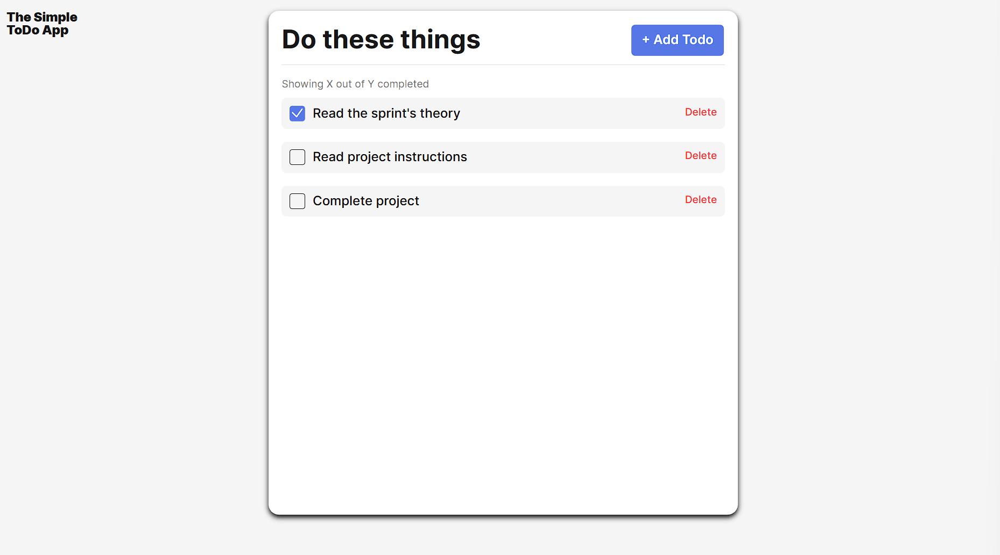

# Simple Todo App

A streamlined to-do app built to help users manage tasks with clarity and efficiency. Designed with a clean UI and intuitive functionality, the app allows users to add, delete, and mark tasks as complete. It emphasizes responsive design, modular architecture, and scalable code practices—reflecting my focus on backend logic, user experience, and maintainable development. Built using JavaScript, it showcases my ability to deliver practical solutions through full-stack development.

## Functionality

The to-do app allows users to efficiently manage daily tasks by adding, deleting, and marking items as complete. It features a clean, responsive interface and supports dynamic task updates in real time. Whether organizing personal goals or work priorities, the app streamlines task tracking with intuitive controls and persistent data storage for a seamless user experience.

## Technology

HTML
CSS
JavaScript

## Deployment

This project is deployed on GitHub Pages:

https://garionmorgan.github.io/se_project_todo-app/
